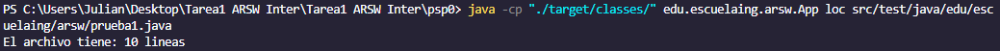
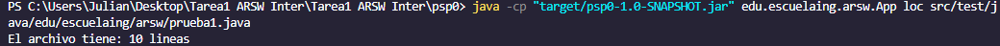
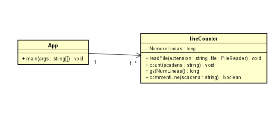

# Tarea 1 ARSW Inter (LOC Counting Assignment kit)

## Realizado por Julian Adolfo Peña Marin

## LOC/h. Rendimiento

* Empezando a las 12:40 pm hasta las 4:00 pm se realizaron en total 251 lineas
* LOC = (251L/3h)
* LOC = 83.66 LOC/h

## Documentación

Para obtener la documentacion se puede utilizar el siguiente comando para generarla

```
    mvn javadoc:javadoc
```
## Como Correrlo
Primero se debe clonar el repositorio, para esto puede utilizar el siguiente comando de git, con la url del repositorio que se quiere clonar, como se muestra a continuación

```
    git clone https://github.com/JulianP-24/tarea1-arsw-inter.git
```

Una vez clonado para empezar a ejecutarlo ponga el siguiente comando

```
    mvn package
```

Despues puede correrlo con el siguiente comando, ubicandose en la carpeta raiz, en este caso se escoge el tipo loc para contar las lineas del archivo prueba1

```
    java -cp "./target/classes/" edu.escuelaing.arsw.App loc src/test/java/edu/escuelaing/arsw/prueba1.java
```


Otra forma pra correrlo, ya generado el JAR, es con el siguiente comando

```
    java -cp "target/psp0-1.0-SNAPSHOT.jar" edu.escuelaing.arsw.App loc src/test/java/edu/escuelaing/arsw/prueba1.java
```


## Diagrama de Clase
A continuacion se muestra el diagrama de clases correspondiente con la aplicacion



En el diagrama se observa dos clases, una es la clase principal que tiene el metodo main, el cual es para correr la aplicacion. En este metodo se hace un llamado a la otra clase llamada lineCounter, en donde con el archivo y el tipo, que se escribieron en consola y que le llegaron como parametros en el metodo readFile, se hace una validadcion y dependiendo de eso se cuentan las lineas correspondientes a traves del metodo count de esa misma clase.

Para retornar el resultado y mostrarlo en pantalla, hay un metodo en la clase lineCounter que retorna la variable con el numero de lineas. En la Clase main se llama a traves de un print en consola, el metodo correspondiente de la otra clase llamado getNumLineas.
